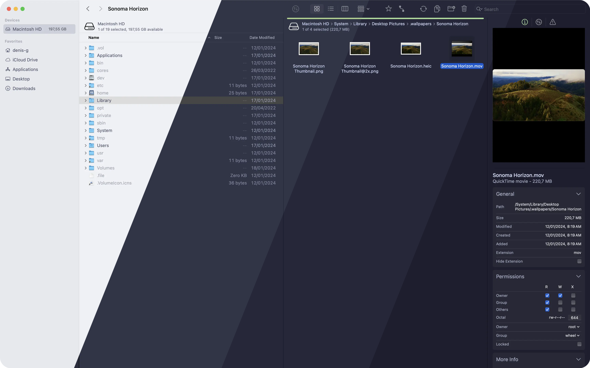
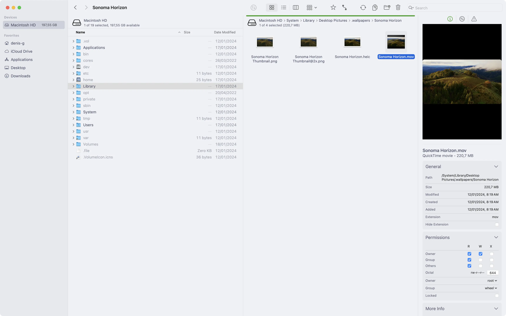
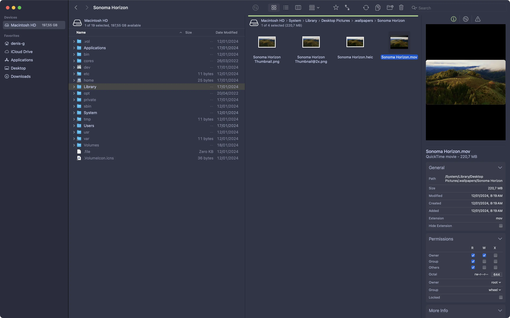
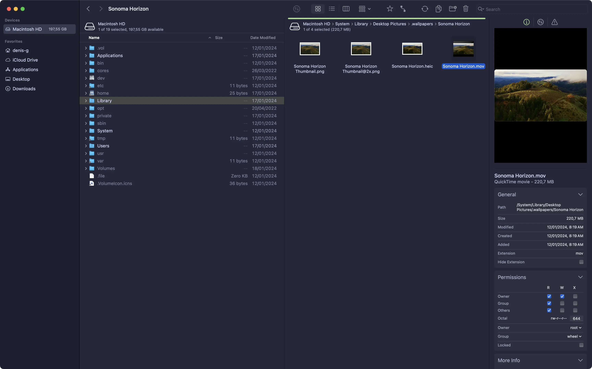
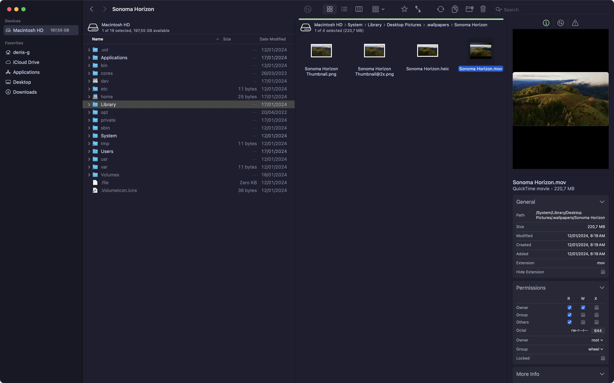

<h3 align="center">
	<br/>
	
	Catppuccin for <a href="https://binarynights.com">Forklift 4</a>
	
</h3>

<p align="center">
	<a href="https://github.com/catppuccin/forklift-4/stargazers"></a>
	<a href="https://github.com/catppuccin/forklift-4/issues"></a>
	<a href="https://github.com/catppuccin/forklift-4/contributors"></a>
</p>

<p align="center">
	
</p>

## Previews

<details>
<summary>🌻 Latte</summary>

</details>
<details>
<summary>🪴 Frappé</summary>

</details>
<details>
<summary>🌺 Macchiato</summary>

</details>
<details>
<summary>🌿 Mocha</summary>

</details>

## Usage

1. Close `Forklift`
2. Open `Terminal`
3. Copy, paste and execute the following command

```
defaults write com.binarynights.ForkLift themes "<data>$(echo -ne '[{"baseColor":{"red":0.11764705181121826,"alpha":1,"blue":0.18039214611053467,"green":0.11764705181121826},"id":"1445ECEE-FEEB-4AE3-9461-A51369649140","sidebarColor":{"blue":0.14509806036949158,"red":0.09411759674549103,"green":0.09411759674549103,"alpha":1},"sidebarItemColor":{"red":0.8039215803146362,"green":0.8392157554626465,"alpha":1,"blue":0.95686274766922},"sidebarSelectionColor":{"green":0.19607838988304138,"red":0.19215688109397888,"alpha":1,"blue":0.2666666805744171},"textColor":{"alpha":1,"blue":0.95686274766922,"red":0.8039215803146362,"green":0.8392157554626465},"sidebarTextColor":{"green":0.8392157554626465,"red":0.8039215803146362,"alpha":1,"blue":0.95686274766922},"secondaryTextColor":{"green":0.6784313917160034,"red":0.6509804129600525,"blue":0.7843136787414551,"alpha":1},"editable":true,"name":"Catppuccin Mocha","highlightColor":{"blue":0.6313725709915161,"alpha":1,"green":0.8901960849761963,"red":0.6509804129600525},"darkStyle":true},{"sidebarItemColor":{"green":0.8392157554626465,"blue":0.95686274766922,"red":0.8039215803146362,"alpha":1},"highlightColor":{"blue":0.5372549295425415,"green":0.8196078538894653,"alpha":1,"red":0.6509804129600525},"sidebarTextColor":{"red":0.7764706015586853,"blue":0.960784375667572,"green":0.8156862854957581,"alpha":1},"secondaryTextColor":{"alpha":1,"green":0.6784313917160034,"blue":0.8078432083129883,"red":0.6470588445663452},"sidebarColor":{"green":0.17254897952079773,"blue":0.23529410362243652,"red":0.1607843041419983,"alpha":1},"id":"CD0631DC-3363-464C-9841-BBE69C5B229E","editable":true,"darkStyle":true,"textColor":{"red":0.7764706015586853,"blue":0.960784375667572,"green":0.8156862854957581,"alpha":1},"baseColor":{"alpha":1,"green":0.2039215862751007,"blue":0.274509459733963,"red":0.1882352977991104},"sidebarSelectionColor":{"red":0.2549019753932953,"alpha":1,"green":0.2705882489681244,"blue":0.3490195870399475},"name":"Catppuccin Frappe"},{"name":"Catppuccin Macchiato","darkStyle":true,"sidebarTextColor":{"alpha":1,"blue":0.960784375667572,"green":0.8274509906768799,"red":0.7921568155288696},"secondaryTextColor":{"green":0.6784313917160034,"blue":0.7960784435272217,"red":0.6470588445663452,"alpha":1},"editable":true,"sidebarItemColor":{"red":0.7921568155288696,"green":0.8274509906768799,"blue":0.960784375667572,"alpha":1},"textColor":{"alpha":1,"red":0.7921568155288696,"green":0.8274509906768799,"blue":0.960784375667572},"sidebarSelectionColor":{"alpha":1,"blue":0.30980393290519714,"green":0.2274509221315384,"red":0.21176469326019287},"id":"BE2C9674-BF1D-489E-ABC8-86C47A602A99","sidebarColor":{"red":0.11764705181121826,"blue":0.1882352977991104,"green":0.1254901885986328,"alpha":1},"baseColor":{"green":0.15294115245342255,"alpha":1,"blue":0.2274509221315384,"red":0.14117646217346191},"highlightColor":{"red":0.6509804129600525,"alpha":1,"green":0.8549019694328308,"blue":0.5843137502670288}},{"textColor":{"red":0.29803913831710815,"alpha":1,"green":0.30980393290519714,"blue":0.4117647409439087},"sidebarSelectionColor":{"green":0.8156862854957581,"alpha":1,"blue":0.8549019694328308,"red":0.800000011920929},"editable":true,"sidebarTextColor":{"alpha":1,"red":0.29803913831710815,"green":0.30980393290519714,"blue":0.4117647409439087},"highlightColor":{"green":0.6274511814117432,"red":0.250980406999588,"blue":0.16862747073173523,"alpha":1},"baseColor":{"green":0.9450981020927429,"alpha":1,"red":0.9372549057006836,"blue":0.960784375667572},"name":"Catppuccin Latte","darkStyle":false,"secondaryTextColor":{"blue":0.46666666865348816,"red":0.36078429222106934,"alpha":1,"green":0.37254902720451355},"id":"7AFE4D86-411E-48A1-9ECA-FFA976253C1E","sidebarColor":{"green":0.9137254953384399,"red":0.9019607901573181,"alpha":1,"blue":0.9372549057006836},"sidebarItemColor":{"green":0.30980393290519714,"alpha":1,"red":0.29803913831710815,"blue":0.4117647409439087}}]'|base64 -o -)</data>"
```
4. Launch `Forklift`
5. Go to `Settings...` (<kbd>CMD + ,</kbd>), `Themes` and select your Catppuccin theme

## 💝 Thanks to

- [denis-g](https://github.com/denis-g)

&nbsp;

<p align="center">
	
</p>

<p align="center">
	Copyright &copy; 2021-present <a href="https://github.com/catppuccin" target="_blank">Catppuccin Org</a>
</p>

<p align="center">
	<a href="https://github.com/catppuccin/catppuccin/blob/main/LICENSE"></a>
</p>
